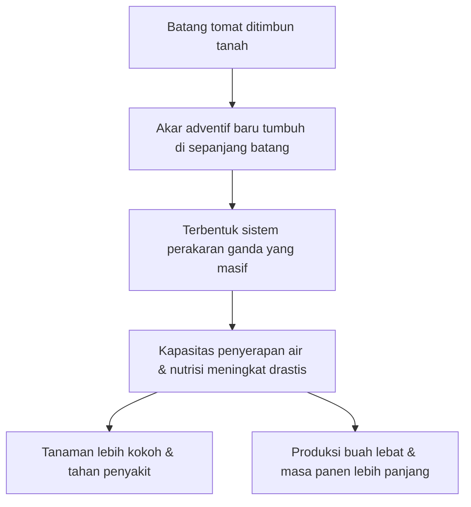

# Teknik Benam Batang agar Tomat Berbuah Lebat & Tahan Lama

> [!quote] Sumber
> - **Sumber:** YouTube Shorts
> - **Link:** https://www.youtube.com/shorts/hcqDopFjkkY

## Poin-Poin Penting

### Teknik "Benam Batang" — 2 Langkah

| Langkah | Waktu | Cara |
|---------|-------|------|
| 1 | **Saat tanam awal** | Tanam bibit tomat dengan **posisi miring** (bukan tegak lurus) |
| 2 | **Saat tinggi ±50 cm** | Rebahkan tanaman, **timbun sebagian batang** dengan media tanam |

### Mengapa Ini Bekerja?

- Batang tomat yang ditimbun akan **merangsang pertumbuhan akar baru** di area yang tertutup tanah
- Semakin banyak akar → tanaman semakin kokoh, penyerapan nutrisi & air meningkat
- Hasil akhir: **buah lebih lebat + usia produktif lebih panjang**



### Ilustrasi Teknik

![[tomato_trench_planting_infographic_1782311250058.png]]
*Ilustrasi penampang melintang (cross-section): Batang tomat yang direbahkan atau ditanam miring lalu ditimbun tanah. Akar-akar baru tumbuh di sepanjang bagian batang yang tertimbun, menciptakan sistem perakaran yang sangat masif.*

```
TANAM AWAL (miring):           TINGGI 50cm (direbahkan & ditimbun):
                                
    \                              ___________ (batang ditimbun)
     \  bibit                           \
      \_____ tanah                       \_____ akar asli
                                          
      akar asli                           tanah tambahan menutupi batang
                                          → akar baru tumbuh di sini
```

## Ide & Wawasan Pribadi

- Teknik ini memanfaatkan sifat alami tomat: batang tomat bisa menghasilkan **akar adventif** (akar yang tumbuh dari batang)
- Kombinasikan dengan catatan sebelumnya: media tanam yang dicampur kompos + POC kulit pisang + teknik benam batang = formula lengkap tomat produktif
- Untuk urban farming di pot/polybag, teknik miring saat tanam awal sangat mudah diterapkan

## Keterkaitan

- [[Tomat]] — catatan utama budidaya tomat
- [[Menanam Tomat Organik — Buah Melimpah]] — strategi nutrisi & pemangkasan
- [[Akar Adventif]] — dasar ilmiah teknik ini
- [[Teknik Penanaman]] — berbagai teknik tanam
